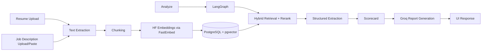

# Career Intelligence Assistant

This is a full-stack Python app for comparing one resume against multiple job descriptions, answering role-fit questions, and generating grounded suggestions.

The project is meant to be practical first: deployable, debuggable, and easy to iterate on.

## Live Deployment

The app is currently live at:

- https://career.insurewise.sbs

## What Is Implemented

- Resume upload: PDF, DOCX, TXT, MD
- Job input: upload files and/or paste description text
- RAG pipeline with PostgreSQL + pgvector
- Hybrid retrieval with lexical matching and reranking
- LangGraph-based analysis flow
- Structured extraction for:
  - skills
  - years of experience
  - domains
  - must-have requirements
- Rule-based fit scorecard with evidence chips and confidence
- Resume tailoring for a selected role:
  - section-wise bullet rewrites
  - evidence tags in each bullet
- Conversational Q&A tied to a selected job
- Request-level observability:
  - request ID
  - model name
  - token usage
  - latency
  - estimated cost
- Regression harness with 20 scorecard cases
- Prompt evaluation harness for tailoring quality, hallucination rate, and grounding coverage

## Tech Stack

- Backend: FastAPI
- UI: Jinja templates + custom CSS
- LLM provider: Groq
- Analysis model: `llama-3.3-70b-versatile`
- Chat model: `llama-3.1-8b-instant`
- Embeddings: `BAAI/bge-small-en-v1.5` via FastEmbed
- Orchestration: LangGraph
- Database: PostgreSQL 16 + pgvector
- ORM: SQLAlchemy 2.x
- Parsing: `pypdf`, `python-docx`
- Runtime: Docker Compose on DigitalOcean

## Architecture



## Local Setup

### Option A: Python

```powershell
py -m venv .venv
.\.venv\Scripts\Activate.ps1
pip install -e .[dev]
Copy-Item .env.example .env
uvicorn app.main:app --reload
```

Open http://localhost:8000

### Option B: Docker

```powershell
Copy-Item .env.example .env
docker compose up --build
```

Open http://localhost:18000

## Environment Variables

- `DATABASE_URL`
- `GROQ_API_KEY`
- `GROQ_ANALYSIS_MODEL`
- `GROQ_CHAT_MODEL`
- `EMBEDDING_MODEL`
- `EMBEDDING_DIMENSIONS`
- `RETRIEVAL_CANDIDATE_POOL`
- `RERANK_TOP_K`
- `HYBRID_VECTOR_WEIGHT`
- `HYBRID_LEXICAL_WEIGHT`

## Why These Choices

### LLMs

I use two models on purpose:

- `llama-3.3-70b-versatile` for deeper analysis reports
- `llama-3.1-8b-instant` for faster interactive chat

That keeps report quality high without making every interaction expensive.

### Embeddings

The app uses open-source Hugging Face embeddings (`BAAI/bge-small-en-v1.5`) through FastEmbed.

Why this setup:

- good quality for this use case
- predictable cost profile
- no second paid embedding dependency

### Vector Store

PostgreSQL + pgvector keeps relational data and vector search in one place and is easy to run on a small server.

### Orchestration

LangGraph is used only for the analysis workflow, not the whole app, to keep complexity under control.

## Quality Controls

- Unsupported or empty files are rejected
- Empty file input parts are ignored when users submit pasted job text
- Prompts require evidence-grounded responses
- Output handles missing evidence explicitly
- Regression checks cover scorecard behavior
- Prompt eval checks cover grounding coverage and hallucination rate

## Evaluation Harness

Run the scorecard regression suite:

```powershell
python evals/run_regression.py
```

Run prompt evaluation for generated outputs:

```powershell
python evals/run_prompt_eval.py
```

This writes a report to `evals/prompt_eval_report.json`.

## Observability

The app logs per-request LLM telemetry to `llm_request_logs`, including:

- request ID
- route
- model used
- prompt/completion/total tokens
- estimated USD cost
- latency

That makes it easier to debug model behavior and monitor spend.

## Production Notes

Current deployment includes:

- Dockerized app + pgvector database
- Nginx reverse proxy
- Let's Encrypt SSL
- dedicated subdomain routing

Likely next production steps:

1. user auth and data isolation
2. background jobs for heavy ingestion
3. object storage for uploaded files
4. dashboard for retrieval quality and spend trends
5. CI pipeline with linting, tests, and image checks

## Engineering Trade-offs

Optimized for:

- clear architecture
- deployability
- explainable retrieval flow

Not over-engineered yet:

- multi-tenant RBAC
- async task queue
- exhaustive integration test matrix
