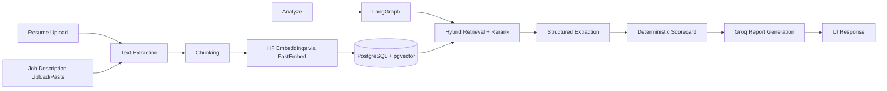

# Career Intelligence Assistant

This is a full-stack Python app that compares one resume against multiple job descriptions, answers role-fit questions, and gives evidence-backed suggestions.

The goal of this project was not to build a flashy demo that breaks easily, but a practical system I could deploy on a real server and iterate on quickly.

## Live Deployment

The app is currently live at:

- https://career.insurewise.sbs

## What Is Implemented Today

- Resume upload: PDF, DOCX, TXT, MD
- Job input: upload files and/or paste description text
- RAG pipeline with PostgreSQL + pgvector
- Hybrid retrieval (vector + lexical) with reranking
- LangGraph orchestration for analysis flow
- Structured extraction for:
	- skills
	- years of experience
	- domains
	- must-have requirements
- Deterministic fit scorecard with evidence chips and confidence
- AI Resume Tailoring Generator:
	- section-wise bullet rewrites for a selected role
	- strict evidence grounding with explicit evidence IDs
- Conversational Q&A tied to selected job context
- Request-level observability:
	- request ID
	- model name
	- token usage
	- latency
	- estimated cost
- Regression harness with 20 curated scorecard cases

## Tech Stack

- Backend: FastAPI
- UI: Jinja templates + custom CSS
- LLM provider: Groq
- Analysis model: `llama-3.3-70b-versatile`
- Chat model: `llama-3.1-8b-instant`
- Embeddings: Hugging Face model `BAAI/bge-small-en-v1.5` via FastEmbed
- Orchestration: LangGraph
- Database: PostgreSQL 16 + pgvector
- ORM: SQLAlchemy 2.x
- Parsing: `pypdf`, `python-docx`
- Runtime: Docker Compose on DigitalOcean

## Architecture



## Local Setup

### Option A: Python (dev mode)

```powershell
py -m venv .venv
.\.venv\Scripts\Activate.ps1
pip install -e .[dev]
Copy-Item .env.example .env
uvicorn app.main:app --reload
```

Open http://localhost:8000

### Option B: Docker

```powershell
Copy-Item .env.example .env
docker compose up --build
```

Open http://localhost:18000

## Environment Variables

- `DATABASE_URL`
- `GROQ_API_KEY`
- `GROQ_ANALYSIS_MODEL`
- `GROQ_CHAT_MODEL`
- `EMBEDDING_MODEL`
- `EMBEDDING_DIMENSIONS`
- `RETRIEVAL_CANDIDATE_POOL`
- `RERANK_TOP_K`
- `HYBRID_VECTOR_WEIGHT`
- `HYBRID_LEXICAL_WEIGHT`

## Why These Choices

### LLMs

I split model usage intentionally:

- `llama-3.3-70b-versatile` for deeper analysis reports
- `llama-3.1-8b-instant` for faster interactive chat

This keeps report quality high without making every interaction expensive.

### Embeddings

I stayed with open-source Hugging Face embeddings (`BAAI/bge-small-en-v1.5`) through FastEmbed.

Why:

- good quality for this use case
- predictable cost profile
- no second paid embedding dependency

### Vector Store

I used PostgreSQL + pgvector because it is straightforward to run on a droplet, and lets me keep relational data and vector search in one place.

### Orchestration

I brought in LangGraph only for analysis flow, not the entire app, to keep complexity under control.

## Quality Controls

- Unsupported/empty files are rejected
- Empty file input parts are ignored when user submits pasted job text
- Prompts enforce evidence-grounded responses
- Output includes explicit missing-evidence behavior
- Regression checks for scorecard behavior (20 cases)

## Evaluation Harness

Run the deterministic scorecard regression suite:

```powershell
python evals/run_regression.py
```

Run continuous prompt evaluation for generated outputs (tailoring quality, hallucination rate, grounding coverage):

```powershell
python evals/run_prompt_eval.py
```

This writes a machine-readable report to `evals/prompt_eval_report.json`.

## Observability

The app logs per-request LLM telemetry to `llm_request_logs`, including:

- request ID
- route
- model used
- prompt/completion/total tokens
- estimated USD cost
- latency

This made it much easier to debug model behavior and watch spend while iterating.

## Production Notes (DigitalOcean)

Current deployment includes:

- Dockerized app + pgvector database
- Nginx reverse proxy
- Let's Encrypt SSL
- dedicated subdomain routing

What I would add next for production-hardening:

1. user auth and data isolation
2. background jobs for heavy ingestion
3. object storage for uploaded files
4. dashboard for retrieval quality and spend trends
5. CI pipeline with linting, tests, and image checks

## Engineering Trade-offs

What I optimized for:

- clear architecture
- deployability
- explainable retrieval flow

What I intentionally did not over-engineer yet:

- multi-tenant RBAC
- async task queue
- exhaustive integration test matrix

## AI Tooling: How I Used It

I used AI coding tools for speed on boilerplate and implementation scaffolding, but validated all key design choices manually (retrieval design, deployment decisions, guardrails, and data flow).

In short: AI helped me move faster, but it did not replace engineering judgment.