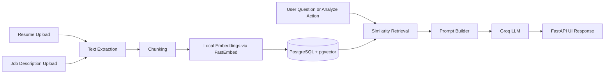

# Career Intelligence Assistant

A full-stack Python web application for comparing a resume against multiple job descriptions, asking grounded career-fit questions, and generating evidence-backed guidance using Groq, PostgreSQL, and pgvector.

## Why this project

This project targets the assignment's "Career Intelligence Assistant" option with a scope that is product-relevant, deployable on a DigitalOcean droplet, and still rich enough to demonstrate real engineering decisions around retrieval, chunking, context management, quality controls, and observability.

## Stack

- Backend and UI: FastAPI + Jinja templates
- LLM provider: Groq
- Primary analysis model: `llama-3.3-70b-versatile`
- Fast chat model: `llama-3.1-8b-instant`
- Embeddings: local `BAAI/bge-small-en-v1.5` via FastEmbed
- Database: PostgreSQL 16 + pgvector
- ORM: SQLAlchemy 2.x
- File parsing: `pypdf` and `python-docx`
- Containerization: Docker + docker compose

## Features

- Upload a single resume in PDF, DOCX, TXT, or Markdown
- Upload multiple job descriptions as files or pasted text
- Chunk and embed both resumes and job descriptions into pgvector
- Run similarity retrieval over the selected job and the indexed resume
- Generate grounded fit analysis using Groq
- Ask follow-up questions with evidence-backed responses

## Architecture Overview



## Quick Start

### Local Python setup

1. Create and activate a virtual environment.
2. Install the project.
3. Start PostgreSQL with pgvector.
4. Copy `.env.example` to `.env` and set `GROQ_API_KEY`.
5. Run the app.

```powershell
python -m venv .venv
.\.venv\Scripts\Activate.ps1
pip install -e .[dev]
Copy-Item .env.example .env
uvicorn app.main:app --reload
```

### Docker setup

```powershell
Copy-Item .env.example .env
docker compose up --build
```

Open http://localhost:8000

## Environment Variables

- `DATABASE_URL`: PostgreSQL connection string using psycopg
- `GROQ_API_KEY`: required for answer generation and analysis
- `GROQ_ANALYSIS_MODEL`: defaults to `llama-3.3-70b-versatile`
- `GROQ_CHAT_MODEL`: defaults to `llama-3.1-8b-instant`
- `EMBEDDING_MODEL`: defaults to `BAAI/bge-small-en-v1.5`
- `EMBEDDING_DIMENSIONS`: defaults to `384`

## RAG and LLM Decisions

### LLM choice

Groq is used for inference because it gives low-latency hosted reasoning with a simple deployment story for a droplet-hosted app. I split the workload between:

- `llama-3.3-70b-versatile` for deep fit analysis
- `llama-3.1-8b-instant` for faster interactive follow-up questions

### Embedding choice

Groq is not used for embeddings here. Instead, embeddings are generated locally with FastEmbed and `BAAI/bge-small-en-v1.5` so the retrieval stack remains deterministic, cheap to run, and independent of a second hosted dependency.

### Vector database choice

PostgreSQL plus pgvector is a pragmatic choice for this assignment because:

- it is easy to run locally and on a DigitalOcean droplet
- structured entities and vector retrieval can live in one system
- operational complexity is lower than running a separate vector database

### Chunking and retrieval

- Chunking is paragraph-aware first, then falls back to sliding windows for very long sections.
- Retrieval is similarity-based against the selected job plus the indexed resume.
- Context is capped to a small number of top chunks to control prompt size.

### Prompt and context management

- Prompts ask the model to ground every statement in provided evidence.
- Missing evidence is treated explicitly instead of being hallucinated away.
- The app keeps analysis and chat flows separate so each can use a tighter prompt and a more suitable model.

### Guardrails and quality controls

- Unsupported or empty files are rejected at upload time.
- The system instructs the LLM to avoid inventing missing skills or experience.
- Answers are based on retrieved chunks and the raw job or resume text.

### Observability

For a production version, add:

- request logging with correlation IDs
- retrieval metrics such as hit distribution and chunk distance
- prompt and response traces in Langfuse or OpenTelemetry
- latency dashboards and Groq error rate tracking

## Productionizing for DigitalOcean

For a successful DigitalOcean deployment, the MVP should be extended with the following:

1. Run the app behind Nginx or Caddy with TLS.
2. Put PostgreSQL on a managed database or isolate it in a private network.
3. Store uploaded source files in Spaces or another object store instead of memory-only processing.
4. Move ingestion into background jobs so large uploads do not block web requests.
5. Add authentication and per-user document isolation.
6. Add retries, rate limiting, audit logs, and request timeouts.
7. Add structured evaluation cases for fit scoring and missing-skill detection.
8. Add CI for tests, linting, and container build verification.

## Engineering Standards Followed

- Clear separation between config, data layer, services, and web routes
- Container-friendly setup with explicit environment variables
- Minimal but functional tests for service health
- Small, explainable retrieval pipeline instead of hidden framework magic

## What I would do next

- Extract structured skills and experience timelines into first-class database tables
- Add hybrid retrieval combining keyword and vector search
- Add job ranking across all indexed roles from a single resume
- Add evaluation fixtures and offline answer-quality scoring
- Add async background jobs for parsing and embedding

## How AI tools were used

AI tools are useful for accelerating boilerplate, comparing library options, and drafting interface scaffolds. They should not be trusted for final architectural reasoning, deployment trade-offs, or README claims without verification. The implementation choices in this repo should be validated and adapted based on real test runs and the target droplet environment.